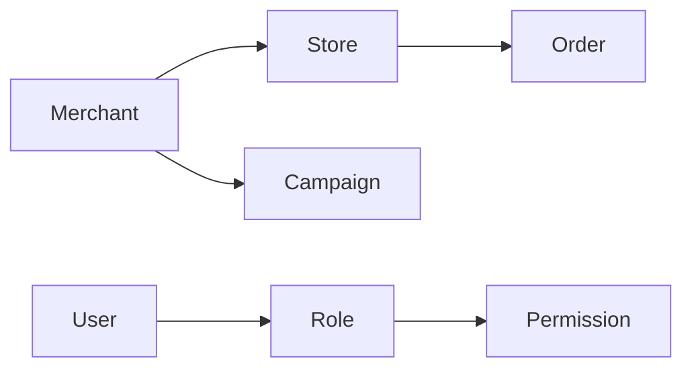

# 03_BUSINESS_DOMAIN.md

---
owner: Product + Frontend Team
last_verified: 2026-04-21
status: active
purpose: 统一项目中的业务术语、角色、实体、状态流转与关键规则，避免“代码写对但业务写错”。
primary_readers:
  - Frontend Developers
  - Product Managers
  - QA
  - AI Agents
related:
  - 01_PROJECT_OVERVIEW.md
  - 02_ARCHITECTURE.md
  - 06_UI_COMPONENT_GUIDE.md
  - 07_API_CONTRACTS.md
  - 09_TECH_SOLUTION_TEMPLATE.md
---

> 使用说明：
>
> - 本文档写“业务事实”和“术语约定”，不要写实现细节
> - 若某个名词有历史歧义，必须明确“本项目中以什么定义为准”
> - 对尚未统一的概念，不要伪装成确定结论，应明确标记为待确认

---

## 1. 文档目标

当看到下面这些词时，应该能快速回答它们分别是什么、彼此什么关系、在哪些页面出现、对应哪些状态：

- 用户 / 商家 / 门店 / 账号 / 操作员
- 活动 / 策略 / 订单 / 任务 / 工单
- 草稿 / 生效中 / 已停用 / 已结束
- 提交 / 发布 / 审核 / 驳回 / 撤回
- 权限 / 角色 / 数据范围

> 业务概念不清，是 AI 写错代码最常见的原因之一。

---

## 2. 业务范围概览

请用 3~10 条简要说明项目覆盖的主要业务域，例如：

- 商家管理
- 门店配置
- 商品与库存
- 活动投放
- 订单查询
- 权限与角色
- 报表与导出

对每个业务域说明：

- 解决什么问题
- 主要用户是谁
- 核心页面在哪里
- 与哪些系统交互

---

## 3. 角色模型

### 3.1 角色列表

请列出项目中的核心角色：

- `<角色 A>`：
  - 职责：
  - 可访问模块：
  - 数据范围：
  - 可执行操作：
- `<角色 B>`：
  - 职责：
  - 可访问模块：
  - 数据范围：
  - 可执行操作：

### 3.2 角色差异的落点

说明角色差异分别体现在哪些层：

- 菜单是否可见
- 页面是否可访问
- 字段是否可编辑
- 操作按钮是否可点
- 导出 / 删除 / 发布等高风险动作是否有额外限制

### 3.3 常见误解

示例：

- “管理员”是否一定拥有所有数据权限
- “查看权限”与“操作权限”是否完全独立
- “角色”与“用户组”是否等价

---

## 4. 核心实体

对每个核心实体建议采用统一结构描述。

### 4.1 实体模板

```md
#### <实体名称>

- 定义：
- 唯一标识：
- 关键字段：
- 与其他实体的关系：
- 在 UI 中出现的位置：
- 在 API 中的典型表现：
- 常见状态：
- 常见误解：
```

### 4.2 建议优先补全的实体

- 用户
- 角色
- 商家
- 门店
- 商品
- 活动
- 订单
- 审批单 / 工单
- 配置项 / 策略项

### 4.3 示例

#### 商家

- 定义：业务合作主体，一个商家下可有多个门店或多个运营实体
- 唯一标识：`merchantId`
- 关键字段：名称、商家状态、所属类目、创建时间、负责人
- 与其他实体关系：一个商家可关联多个门店；活动通常归属商家维度
- UI 位置：商家列表页、商家详情页、活动配置页的选择器
- API 表现：列表接口返回简要信息，详情接口返回完整配置
- 常见状态：待启用、启用中、停用中、已停用
- 常见误解：商家与门店不是同一层级，不应混用字段名称

> 示例只是写法参考，不代表你的真实业务事实。

---

## 5. 关系模型

请说明核心实体之间的关系，例如：

- 一个商家对应多个门店
- 一个活动只能归属一个商家
- 一个订单必定属于一个门店
- 一个用户可以拥有多个角色
- 一个角色可以配置多个权限点

若有必要，可使用 Mermaid 表达：



请补充：

- 1:1 / 1:N / N:N
- 主从关系
- 真值来源
- UI 中是否会被简化展示

---

## 6. 状态与生命周期

这是最容易被实现错误的部分，建议明确每个核心实体的状态机。

### 6.1 状态模板

```md
#### <实体名称> 状态流转

- 状态集合：
- 初始状态：
- 可流转路径：
- 不可逆状态：
- 角色限制：
- 前端展示要求：
- 禁用 / 隐藏规则：
```

### 6.2 需要优先写清的状态

- 草稿 / 待提交 / 审核中 / 已通过 / 已驳回
- 已启用 / 已停用 / 已删除
- 待支付 / 已支付 / 已取消 / 已退款
- 生效中 / 已失效 / 已结束

### 6.3 状态显示与行为

请说明：

- 页面标签显示文案
- 颜色规范
- 不同状态下可执行操作
- 状态切换是否需要二次确认
- 状态切换后是否要刷新列表 / 详情 / 统计信息

---

## 7. 核心流程

推荐把关键业务流程写成用户视角的步骤，而不是只写后台规则。

### 7.1 流程模板

```md
#### <流程名称>

1. 用户从哪里进入
2. 需要选择或填写什么
3. 系统校验什么
4. 成功后进入什么状态
5. 失败时如何处理
6. 哪些角色可执行
7. 哪些页面会受影响
```

### 7.2 建议优先沉淀的流程

- 创建 / 编辑 / 发布
- 审核 / 驳回 / 撤回
- 启用 / 停用
- 查询 / 筛选 / 导出
- 批量操作
- 上传 / 导入 / 下载

### 7.3 流程中的待确认项

如果存在跨团队依赖，例如：

- 审核状态由哪个系统返回
- 失败文案由谁定义
- 批量操作上限由后端还是前端控制

请单独列出，不要藏在正文里。

---

## 8. 关键业务规则

这里记录那些“代码里如果没体现，就等于做错”的规则。

示例分类：

- 权限规则
- 数据范围规则
- 表单校验规则
- 状态前置条件
- 金额 / 时间 / 时区规则
- 默认值规则
- 导出、删除、发布等高风险动作规则

推荐写法：

```md
- 规则名称：
- 适用范围：
- 规则说明：
- 前端需要体现的位置：
- 不能做的错误实现：
```

示例：

- 规则名称：已结束活动不可编辑
- 适用范围：活动详情、活动列表、批量操作
- 规则说明：活动结束后只能查看，不允许再次发布或修改
- 前端体现：隐藏编辑按钮；批量操作禁用；详情页显示只读提示
- 错误实现：仅在详情页禁用按钮，但列表页仍能触发编辑入口

---

## 9. 术语表

这是 AI 最常查的一节，建议简洁明确。

### 9.1 术语模板

- `<术语>`：`<定义>`
- `<术语>`：`<定义>`
- `<术语>`：`<定义>`

### 9.2 易混淆术语

建议重点列出：

- 商家 vs 门店
- 发布 vs 生效
- 删除 vs 停用
- 用户角色 vs 数据权限
- 模板 vs 实例
- 策略 vs 活动
- 草稿保存 vs 提交审核

### 9.3 命名一致性要求

请明确：

- 前端展示文案用什么
- 代码变量名用什么
- API 字段用什么
- 哪些历史字段名虽然存在，但不推荐继续扩散

---

## 10. UI / API 对齐说明

对容易错的领域概念，建议写清 UI 和 API 的映射关系：

- 页面标签文案
- 接口字段值
- 枚举值
- 颜色或图标
- 可执行操作

示例：

- UI 显示：`已停用`
- API 枚举：`DISABLED`
- Tag 颜色：`default / gray`
- 允许操作：`查看、启用`
- 禁止操作：`编辑、发布`

> 这些信息也可以与 `07_API_CONTRACTS.md` 互相引用，但不要出现冲突。

---

## 11. 常见误解与历史坑

建议记录团队里经常被误解的业务点，例如：

- 某状态不是最终态，不能当作“完成”
- 某角色能看到页面，不代表能执行按钮操作
- 某字段为空不表示无数据，而是表示未初始化
- 某导出接口是异步任务，不是即时下载
- 某“删除”实际上是逻辑删除，不应从 UI 彻底消失

这类信息非常适合 AI 使用，因为它能减少“看着像对，其实不对”的代码生成。

---

## 12. 待确认与未决问题

对尚未统一的业务定义，请用下面格式记录：

- 问题：
- 当前现状：
- 风险：
- 需要谁确认：
- 暂时处理原则：

不要把未决问题藏在评审记录、聊天记录或个人记忆里。

---

## 13. 注意事项

修改业务逻辑前，应优先查阅本文件中的术语定义、角色差异、状态流转、关键规则和易混淆概念。

避免以下做法：

- 看到英文枚举就自行推断业务含义
- 仅根据某个页面表现推断全局业务规则
- 将历史字段名当作推荐命名继续扩散
- 未确认就改动状态流转与权限判断

---

## 14. 建议先补哪些内容

若时间有限，建议按以下优先级补齐：

1. 核心角色和权限差异
2. 3~5 个核心实体定义
3. 最关键的状态机
4. 2~3 条最容易写错的业务规则
5. 10~20 个高频术语
6. 关键流程的简化版说明
