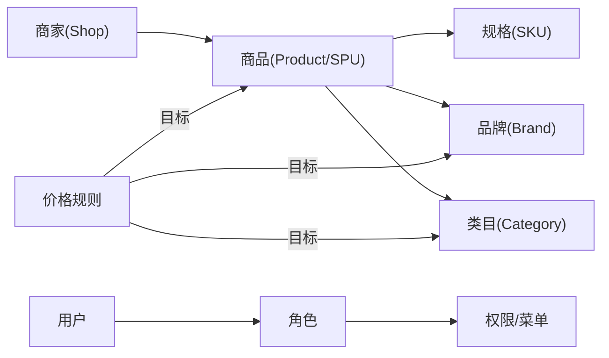

# 03_BUSINESS_DOMAIN.md

---
owner: Product + Frontend Team
last_verified: 2026-05-08
status: active
purpose: 统一项目中的业务术语、角色、实体、状态流转与关键规则，避免"代码写对但业务写错"。
primary_readers:
  - Frontend Developers
  - Product Managers
  - QA
  - AI Agents
related:
  - 01_PROJECT_OVERVIEW.md
  - 02_ARCHITECTURE.md
  - 11_DANGEROUS_AREAS.md
---

## 1. 业务范围概览

| 业务域 | 解决的问题 | 主要用户 | 核心 App |
|--------|-----------|---------|---------|
| 商家管理 | 商家入驻审核、信息维护、状态管理 | 运营人员 | app-merchant |
| 商品中心 | 商品上下架审核、价格规则配置 | 运营人员 | app-product |
| 系统管理 | 账号、角色、权限配置 | 系统管理员 | app-system |
| 认证授权 | 登录、token、菜单下发 | 所有用户 | micro-main |

---

## 2. 角色模型

### 2.1 角色列表

目前已知角色（具体权限点待确认）：

- **超级管理员**：全量菜单和操作权限
- **运营人员**：商家管理、商品管理模块，具体权限范围 <!-- TODO: 待确认 -->
- **系统管理员**：账号、角色、权限管理模块

### 2.2 角色差异的落点

- **菜单可见性**：由后端下发菜单树决定，主基座动态生成路由
- **页面访问权限**：路由守卫根据 permission store 判断
- **按钮权限**：<!-- TODO: 待确认当前是否有统一的按钮权限判断方案 -->

---

## 3. 核心实体

### 3.1 商家（Shop）

- **定义**：在大厨管家平台入驻的供应商/商户，对应系统中的"门店"概念
- **唯一标识**：`id`（string）
- **关键字段**：

| 字段 | 类型 | 说明 |
|------|------|------|
| `id` | string | 商家 ID |
| `name` | string | 商家名称 |
| `status` | `MerchantStatus` | 当前状态 |
| `type` | `MerchantShopType` | 商家类型 |
| `contact` | string | 联系人 |
| `phone` | string | 联系电话 |
| `joinedAt` | string | 入驻时间 |

- **与其他实体关系**：一个商家可关联多个品牌资质；商品归属于商家（shopId）
- **UI 位置**：`app-merchant` 的列表页、详情页、表单页、审核页
- **API 位置**：`apps/app-merchant/src/api/merchant.ts`
- **常见误解**：本项目中"商家"和"门店"指同一个实体（Shop），不要拆成两个层级

### 3.2 商品（Product / SPU）

- **定义**：平台上可售卖的商品，以 SPU 为单位管理，每个 SPU 可有多个 SKU
- **唯一标识**：`spuId`（string）
- **关键字段**：

| 字段 | 类型 | 说明 |
|------|------|------|
| `spuId` | string | SPU ID |
| `productName` | string | 商品名称 |
| `status` | `ProductStatus` (1/2/3/4) | 当前状态 |
| `shopId` | number | 所属商家 ID |
| `brandId` | number | 品牌 ID |
| `categoryId` | number | 类目 ID |
| `skus` | `ProductSkuResp[]` | SKU 列表 |

- **与其他实体关系**：商品归属于商家（shopId）；商品有品牌和类目
- **UI 位置**：`app-product` 的商品列表、商品详情
- **API 位置**：`apps/app-product/src/api/product.ts`

### 3.3 价格规则（PriceRule）

- **定义**：运营配置的批量定价策略，可对商品/品牌/类目维度按固定金额或比例加价
- **唯一标识**：`id`（string）
- **关键字段**：

| 字段 | 类型 | 说明 |
|------|------|------|
| `id` | string | 规则 ID |
| `ruleName` | string | 规则名称 |
| `status` | `PriceRuleStatus` | 生命周期状态 |
| `filterStatus` | `PriceRuleSyncStatus` | 同步状态 |
| `dimension` | `PriceRuleDimension` | 目标维度 |
| `method` | `PriceRuleMethod` | 加价方式 |
| `value` | number | 加价数值 |

- **UI 位置**：`app-product` 的价格规则列表、详情面板
- **API 位置**：`apps/app-product/src/api/product-price-rule.ts`

---

## 4. 关系模型

---

## 5. 状态与生命周期

### 5.1 商家状态（MerchantStatus）

| 枚举值 | UI 显示 | 说明 |
|--------|---------|------|
| `ENABLED` | 已启用 | 正常营业中的商家 |
| `DISABLED` | 已停用 | 停止合作或被下线的商家 |
| `PENDING` | 待审核 | 提交入驻申请，待运营审核 |

- 状态流转：`PENDING` → `ENABLED` 或 `PENDING` → `DISABLED`；`ENABLED` ↔ `DISABLED`
- `PENDING` 状态下可执行：审核（通过 → ENABLED，拒绝 → DISABLED）
- `ENABLED` 状态下可执行：停用
- `DISABLED` 状态下可执行：启用

> 商家列表筛选状态（`MerchantFilterStatus`）只有 `''`/`ENABLED`/`DISABLED`，不含 `PENDING`（PENDING 走审核流）

### 5.2 商品状态（ProductStatus）

| 枚举值 | UI 显示 | 说明 |
|--------|---------|------|
| `1` | 待审核 | 商家上传后等待运营审核 |
| `2` | 已上架 | 审核通过，对外可见 |
| `3` | 审核驳回 | 运营拒绝，需商家修改重新提交 |
| `4` | 已下架 | 曾上架，被主动下架或违规处理 |

- 新增对应常量：`PRODUCT_STATUS_LABEL`（`apps/app-product/src/types/product.ts`）
- 注意：存在两套状态系统（数字枚举 `ProductStatus` 和旧字符串枚举 `ProductLegacyStatus`），旧接口用 `PENDING/ONLINE/REJECTED/OFFLINE`，新接口用 `1/2/3/4`

### 5.3 价格规则生命周期状态（PriceRuleStatus）

| 枚举值 | UI 显示 | 说明 |
|--------|---------|------|
| `NOT_STARTED` | 未生效 | 规则已创建但未到生效时间 |
| `ACTIVE` | 生效中 | 当前正在生效的规则 |
| `DISABLED` | 已停用 | 被手动停用 |
| `EXPIRED` | 已失效 | 超过有效期自动失效 |

### 5.4 价格规则同步状态（PriceRuleSyncStatus）

| 枚举值 | UI 显示 | 说明 |
|--------|---------|------|
| `COMPLETED` | 已完成 | 价格数据同步完成 |
| `IMPORTING` | 导入中 | 价格数据正在同步中 |

> 注意：列表页用 `filterStatus`（同步状态），而非 `status`（生命周期状态）作为主要筛选维度

---

## 6. 核心业务规则

### 规则 1：商家入驻审核

- 适用范围：`app-merchant` 的审核页面
- 规则说明：`PENDING` 状态的商家需运营人员审核，通过则变为 `ENABLED`，拒绝变为 `DISABLED`
- 前端体现：审核页显示审核操作，列表页不显示 PENDING 商家的启用/停用按钮
- 错误实现：在列表页对 PENDING 商家显示启用/停用按钮

### 规则 2：商品状态操作约束

- 适用范围：`app-product` 商品列表、详情
- 规则说明：只有 `已上架(2)` 的商品可以下架；`待审核(1)` 的商品不可编辑
- 前端体现：根据状态控制操作按钮的显示/禁用

### 规则 3：价格规则维度互斥

- 适用范围：价格规则创建表单
- 规则说明：一个价格规则只能选择一种维度（PRODUCT/BRAND/CATEGORY），不能混用
- 前端体现：维度选择后，目标选择器切换对应的选项

### 规则 4：价格规则加价方式

- 适用范围：价格规则
- `FIXED`：固定金额加价（单位：分或元，<!-- TODO: 确认单位 -->）
- `RATE`：比例加价（如 10 表示加价 10%，<!-- TODO: 确认比例单位 -->）

---

## 7. 术语表

### 7.1 核心术语

- **商家 / 门店 / Shop**：同一概念，本项目中不区分商家和门店，统一用 `shop` 字段
- **SPU**：商品的最小展示单位（Standard Product Unit），`spuId` 为唯一标识
- **SKU**：商品的可售单位（Stock Keeping Unit），含规格、价格、库存
- **结算价（settlementPrice）**：平台向商家支付的价格
- **销售价（salePrice）**：用户在平台上看到并支付的价格
- **毛利率（margin / grossRate）**：`(salePrice - settlementPrice) / salePrice * 100%`
- **价格规则**：批量修改商品销售价的规则，按商品/品牌/类目维度配置
- **同步状态（filterStatus）**：价格规则数据同步到商品价格的进度

### 7.2 易混淆术语

| 混淆点 | 正确理解 |
|--------|---------|
| 商家 vs 门店 | 本项目中是同一层级，都叫 Shop，不要分两级 |
| ProductStatus(数字) vs ProductLegacyStatus(字符串) | 新接口用数字枚举(1/2/3/4)，旧接口用字符串(PENDING/ONLINE/REJECTED/OFFLINE)，不要混用 |
| PriceRuleStatus vs PriceRuleSyncStatus | `status` 是规则生命周期，`filterStatus` 是数据同步进度，两个独立字段 |
| settlementPrice vs salePrice | 结算价是给商家的，销售价是给用户的 |
| 商家类型 POP/SERVICE_SUPPLY/GOODS_SUPPLY | <!-- TODO: 待确认各类型的业务含义 --> |

---

## 8. UI / API 对齐说明

### 商家状态

| UI 显示 | API 枚举 | Tag 样式 |
|---------|---------|---------|
| 已启用 | `ENABLED` | 绿色（success） |
| 已停用 | `DISABLED` | 灰色（default） |
| 待审核 | `PENDING` | 橙色（warning） |

### 商品状态

| UI 显示 | API 枚举 | 说明 |
|---------|---------|------|
| 待审核 | `1` / `PENDING` | — |
| 已上架 | `2` / `ONLINE` | — |
| 审核驳回 | `3` / `REJECTED` | — |
| 已下架 | `4` / `OFFLINE` | — |

### 价格规则状态

| UI 显示 | API 枚举 |
|---------|---------|
| 未生效 | `NOT_STARTED` |
| 生效中 | `ACTIVE` |
| 已停用 | `DISABLED` |
| 已失效 | `EXPIRED` |

---

## 9. 待确认项

- 问题：商家类型 `POP`、`SERVICE_SUPPLY`、`GOODS_SUPPLY` 的业务含义
  - 当前现状：代码中有枚举，未见文案配置
  - 风险：前端可能显示错误文案
  - 需要谁确认：产品/后端
  - 暂时处理：保持 typeLabel 字段（后端返回）展示

- 问题：价格规则加价数值单位（元/分、百分比精度）
  - 当前现状：`value: number`，未见注释
  - 风险：显示时换算错误
  - 需要谁确认：后端接口文档

- 问题：按钮权限是否有统一前端判断方案
  - 当前现状：各页面自行控制
  - 风险：权限判断不一致
  - 需要谁确认：前端负责人

---

## 10. 真实性校验

- [x] 商家实体字段来自 `apps/app-merchant/src/types/merchant.ts`
- [x] 商品实体字段来自 `apps/app-product/src/types/product.ts`
- [x] 价格规则字段来自 `apps/app-product/src/types/price-rule.ts`
- [ ] 商家状态流转（PENDING→ENABLED 等）待业务负责人确认
- [ ] 商家类型枚举含义待确认
- [ ] 价格规则加价单位待确认
